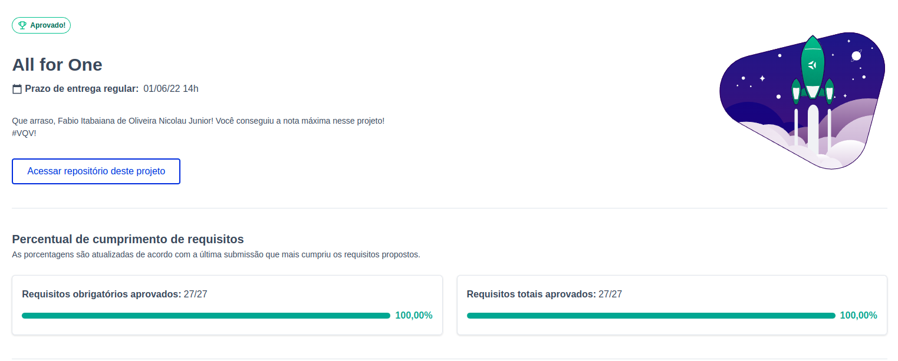

<h1>Sobre</h1>

Segundo projeto do módulo 3 - Back-end, da <a href="https://betrybe.com" target="_blank">Trybe!</a>

Dessa vez foi o projeto All for one. O desafio foi desenvolver um CRUD com querysfiltrar, criar, atualizar e deletar dados usando o mySQL.

<h1>Tecnologias utilizadas</h1>

<ul>
  <li>Docker</li>
  <li>MySQL</li>
</ul>

<h1>Nota</h1>

